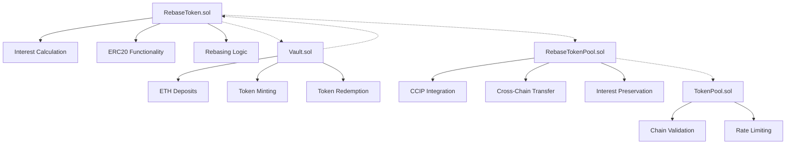

# Cross-Chain Rebase Token


## 📌 Overview

The Cross-Chain Rebase Token is an innovative DeFi solution that combines the stability of rebase mechanics with the flexibility of cross-chain functionality. Built on Foundry and powered by Chainlink CCIP, this token system is designed to maintain value stability while enabling seamless transfers across multiple blockchain networks.

By integrating dynamic interest calculations with secure cross-chain messaging, the project addresses key challenges in DeFi: maintaining consistent value across chains, ensuring liquidity, and providing user-friendly mechanisms for earning interest on holdings.

## 🌟 Key Features

### Token Mechanics
- **Dynamic Interest Accrual**: Automatic interest calculation based on customizable rates and time elapsed
- **User-Specific Interest Rates**: Flexible system allowing different interest rates for different users or use cases
- **Rebasing Mechanism**: Balance adjustment that reflects accurate interest accumulation in real-time
- **High Precision**: All calculations performed with 18 decimal places (1e18) for maximum accuracy

### Cross-Chain Integration
- **Chainlink CCIP Support**: Secure, reliable cross-chain transfers using Chainlink's Cross-Chain Interoperability Protocol
- **Interest Preservation**: User-specific interest rates maintained across different chains
- **Transparent Messaging**: All cross-chain operations can be verified and tracked
- **Multi-Chain Compatibility**: Works across all major EVM-compatible blockchains

### Economic Model
- **Managed Supply**: Controlled token issuance through authorized minting and burning
- **ETH Backing**: Each token backed by ETH in the vault for inherent value stability
- **Efficient Liquidity**: Improved liquidity across chains through bridging mechanisms
- **Inclusive Governance**: Framework for community-driven interest rate adjustments (future enhancement)

### Security and Access Control
- **Role-Based Permissions**: Clearly defined roles for various operations
- **Chain Validation**: Ensures token transfers only occur between authorized chains
- **Rate Limiting**: Prevents excessive tokens from being transferred in a short period
- **Secure Vault Design**: Protects user deposits with robust security measures

## 🔧 Technical Architecture

### Smart Contract Structure



### Core Components

#### `RebaseToken.sol`
The foundation of the system, implementing:
- ERC20 standard with dynamic interest accrual
- Custom balance calculation that includes accrued interest
- Mechanisms for tracking individual user interest rates
- Mint and burn functions with role-based access control

#### `Vault.sol`
Enables interaction with the token:
- Accepts ETH deposits to mint RebaseTokens
- Manages redemption of RebaseTokens for ETH
- Maintains the ETH backing for all tokens in circulation
- Includes safety measures for secure operations

#### `RebaseTokenPool.sol`
Specialized pool for cross-chain transfers:
- Custom implementation of Chainlink CCIP's TokenPool
- Handles burning on source chain and minting on destination chain
- Preserves user-specific interest data during transfers
- Maintains rate limits and chain validation

### Interest Calculation

The project implements a linear interest model, with the formula:

**Accrued Interest = Principal × Interest Rate × Time Elapsed**

Where:
- **Principal**: The original amount of tokens
- **Interest Rate**: Annual interest rate (in basis points, 1 basis point = 0.01%)
- **Time Elapsed**: Time since the last interest calculation (in seconds)

The calculation is executed dynamically whenever:
- Balance information is requested
- Tokens are transferred
- Tokens are minted or burned
- Users interact with the vault

## 🚀 Getting Started

### Prerequisites
- [Foundry](https://book.getfoundry.sh/getting-started/installation) installed
- [Node.js](https://nodejs.org/) (v14 or higher)
- Access to blockchain network RPC endpoints
- Chainlink CCIP supported network access

### Installation

1. Clone the repository:
   ```bash
   git clone https://github.com/your-username/rebase-token-project.git
   cd rebase-token-project
   ```

2. Install dependencies:
   ```bash
   forge install
   ```

3. Configure environment variables in `.env`:
   ```env
   PRIVATE_KEY=<your-private-key>
   RPC_URL_ETHEREUM=<ethereum-rpc-url>
   RPC_URL_POLYGON=<polygon-rpc-url>
   RPC_URL_ARBITRUM=<arbitrum-rpc-url>
   RPC_URL_OPTIMISM=<optimism-rpc-url>
   RPC_URL_AVALANCHE=<avalanche-rpc-url>
   ETHERSCAN_API_KEY=<etherscan-api-key>
   POLYGONSCAN_API_KEY=<polygonscan-api-key>
   ```

### Deployment

#### Local Testing Deployment

Start a local Anvil instance:
```bash
anvil
```

Deploy to local environment:
```bash
forge script scripts/Deploy.s.sol:Deploy --rpc-url http://localhost:8545 --private-key <local-private-key> --broadcast
```

#### Testnet/Mainnet Deployment

Deploy to a specific network:
```bash
forge script scripts/Deploy.s.sol:Deploy --rpc-url $RPC_URL_ETHEREUM --private-key $PRIVATE_KEY --broadcast --verify
```

#### Cross-Chain Setup

Configure the token pool for cross-chain transfers:
```bash
forge script scripts/ConfigurePool.s.sol:ConfigurePoolScript --rpc-url $RPC_URL_ETHEREUM --private-key $PRIVATE_KEY --broadcast --verify
```

## 🔍 Contract Interactions

### Token Operations

#### Minting Tokens
```solidity
// Mint tokens with custom interest rate
rebaseToken.mint(address recipient, uint256 amount, uint256 interestRate);
```

#### Checking Balance
```solidity
// Get current balance including accrued interest
uint256 balance = rebaseToken.balanceOf(address user);
```

#### Transferring Tokens
```solidity
// Transfer tokens with interest recalculation
rebaseToken.transfer(address recipient, uint256 amount);
```

#### Setting Interest Rate
```solidity
// Admin function to adjust global interest rate
rebaseToken.setInterestRate(uint256 newInterestRate);
```

### Vault Operations

#### Depositing ETH
```solidity
// Deposit ETH and receive RebaseTokens
vault.deposit{value: ethAmount}();
```

#### Redeeming Tokens
```solidity
// Redeem RebaseTokens for ETH
vault.redeem(uint256 tokenAmount);
```

### Cross-Chain Transfers

#### Initiating a Cross-Chain Transfer
```solidity
// Transfer tokens from one chain to another
IRouterClient router = IRouterClient(routerAddress);
Client.EVM2AnyMessage memory message = Client.EVM2AnyMessage({
    receiver: abi.encode(receiverAddress),
    data: abi.encode(userData),
    tokenAmounts: tokenAmounts,
    extraArgs: extraArgs,
    feeToken: feeTokenAddress
});

uint256 fee = router.getFee(destinationChainSelector, message);
bytes32 messageId = router.ccipSend{value: fee}(destinationChainSelector, message);
```


## 📊 Performance and Gas Optimization

The contracts are optimized for gas efficiency:

- **Storage Optimization**: Minimized storage reads and writes
- **Efficient Calculations**: Optimized interest calculations to reduce gas costs
- **Batch Processing**: Where applicable, operations are batched
- **Assembly Usage**: Strategic use of assembly for certain operations

## 🔒 Security Considerations

### Audit Status

The contracts have undergone the following security measures:
- Internal code review
- Static analysis with Slither
- Formal verification of critical functions
- Comprehensive test suite with high coverage

### Key Security Features

1. **Access Control**: Strict role-based permissions for sensitive operations
2. **Rate Limiting**: Prevents excessive token transfers
3. **Pause Mechanism**: Ability to pause operations in case of emergency
4. **Input Validation**: Thorough validation of all user inputs
5. **Reentrancy Protection**: Guards against reentrancy attacks

## 🛣️ Roadmap

### Phase 1 (Current)
- Core token functionality
- Basic cross-chain transfers
- ETH-backed vault

### Phase 2 (Upcoming)
- Enhanced governance mechanisms
- Additional collateral types
- Integration with additional DEXs

### Phase 3 (Future)
- Advanced interest models
- Yield farming strategies
- Cross-chain liquidity pools

## 👥 Contributors

- **Aditya** -  Developer & Architect


## 📄 License

This project is licensed under the [MIT License](LICENSE).

## 📞 Contact

For inquiries or support:
- Email: adityakumar41205@gmail.com
- Twitter: [@Aditya](https://twitter.com/Adityaalchemist)

---

<p align="center">
  <sub>Built with ❤️ by Aditya </sub>
</p>
